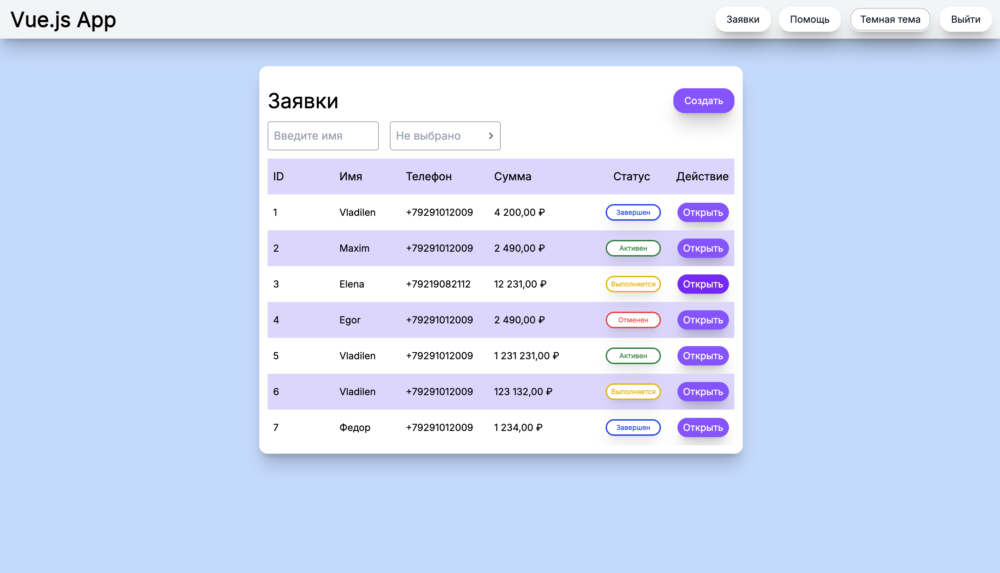
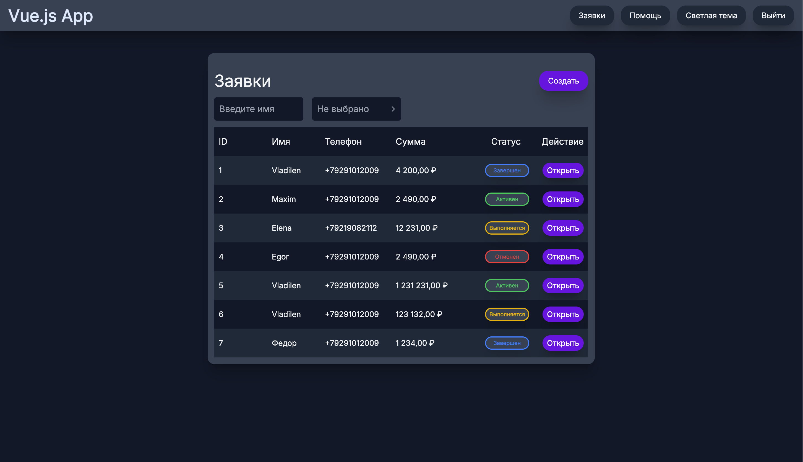

# 🌗 Pet-проект на Vue: Демо UI + Honeypot

###### [Ссылка на Vercel деплой](https://vue-practice-1-lilac.vercel.app/)




## 🧰 Stack

- Vue 3 + Composition API
- Vue Router
- Pinia
- TypeScript
- Vite
- TailwindCSS + тёмная/светлая тема
- ESLint, Prettier
- GitHub Actions + Vercel (деплой)

## ⚙️ Features

- Ручная настройка Vite
- Honeypot `.env.fake` доступен по прямой ссылке
- Собственный [ui framework](https://www.npmjs.com/package/@maikovskii-danil/ui-framework-vue)
- ESLint + Prettier (ручная конфигурация)

## 🛠 About Enviroment

🖥️ Проект разработан и протестирован для macOS/linux для Chrome (Рекомендованная ширина экрана: 1440px)

⚙️ Node.js: 22.17.0

📦 npm: 11.4.2

❗ Поддержка Windows не гарантируется

##### Но Вы можете попробовать его запустить на Windows.

##### Для этого удалите поле "os" в package.json или измените на значение ниже:

```json
{
  "os": ["darwin", "linux", "win32"]
}
```

##### После запустите `npm install`

## 🔐 Авторизация

Авторизация работает с фейковыми учётными данными (имитация входа).

- Email: `some.user@automation.testing`
- Password: `123456`

### Project Setup & Compile and Hot-Reload for Development

```sh
npm start
```

###### Перед `"start"` npm запустит `npm clean-install`

### Project Setup, Compile and Minify for Production

```sh
npm run build
```

###### Перед `"build"` npm запустит `npm clean-install`

###### Если что-то заинтересовало — можете написать мне.

- maikovsky.danil@gmail.com
- Telegram: [@danilmaikovsky](https://t.me/danilmaikovsky)
